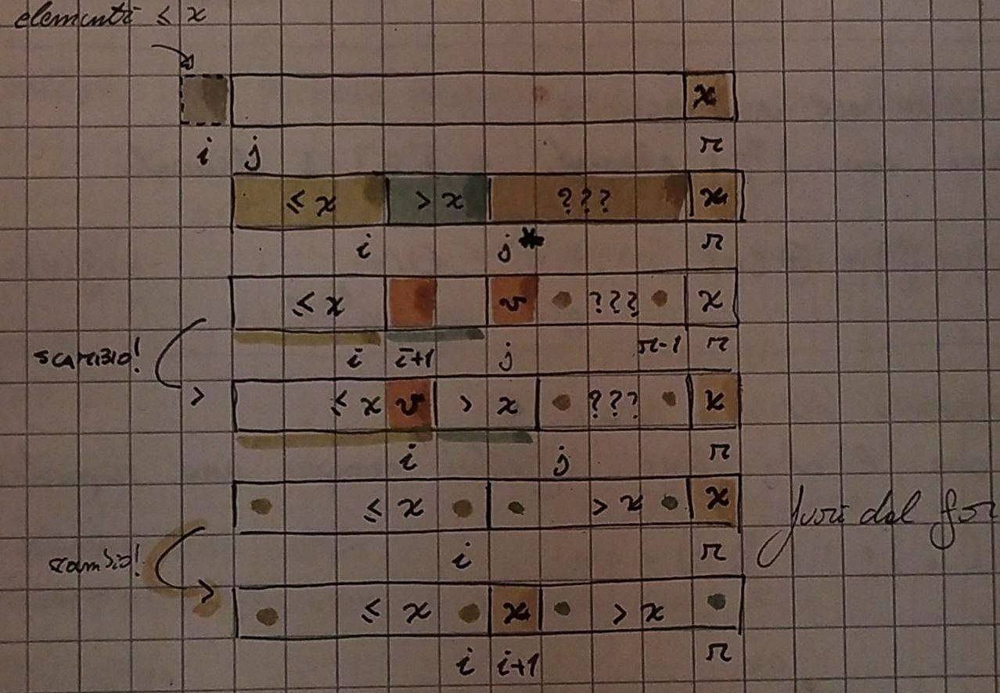
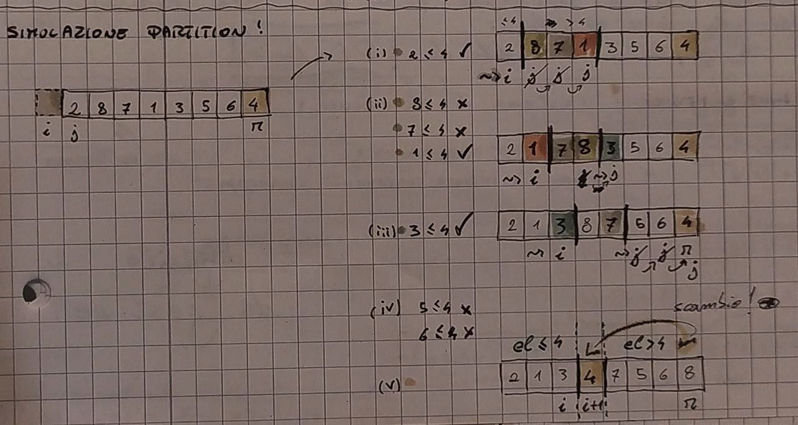
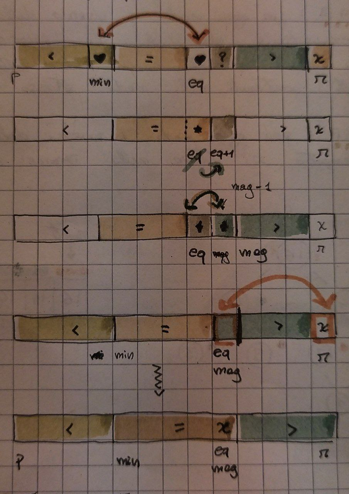

## Quick sort (<3)

Utilizza la tecnica del _divide-et-impera_ per ordinare un array A[p...r].

- divide partizionando l'array A[p ... r] in due sottoarray A[p ... **q-1**] e A[**q+1** ... r] _(anche se vuoti!)_ tali che ogni elemento di A[p...q-1] è _minore o uguale_ ad A[q] che a sua volta è _minore_ di ogni elemento in A[q+1...r].

  - q è parte del partizionamento
  - A[q] è chiamato **pivot**

  ```
      +---------+---+------------+
      | el <= x | x |   el > x   |
      +---------+---+------------+
      p           q             r
  ```

- impera ordinando ricorsivamente i due sottoarray A[p...q-1] e A[q+1...r] chiamando il **quick sort**. se il sotto problema è sufficientemente piccolo (_zero o un elemento_) risolve direttamente

  ```
      +---------+---+------------+
      | ordina | x |   ordina    |
      +---------+---+------------+
      p           q             r

  ```

- combina non fa nulla dato che i due sottoarray sono ordinati in loco, ma allora ho che A[p...r] è _ordinato_

### Codice quick sort (pseudocodice)

```pseudocode
# post: ordina A[p...r]
quick_sort(A, p, r)
  if p < r  # ho almeno due elementi
    q = partition(A, p, r)
    quick_sort(A, p, q-1)
    quick_sort(A, q+1, r)


partition(A, p, r)
  x = A[r]  # scelgo il pivot come ultimo elemento
  i = p-1
  for j = p to r-1
    if(A[j] <= x)
      i = i+1
      scambio A[i] e A[j]     #(a)
  scambio A[i+1] e A[r]       #(b)
  return A[i+1]
```





#### Invariante ciclo for

Inv = x=A[r] and per ogni k in [p...i]: A[k] <= x<br>
             and per ogni k in [i+1...j-1]: A[k] > x (da j inizia la porzione non so)<br>
             and (p<=j<=r) and (p-1<=i<=j-1)

_conclusione_<br>
quando il ciclo termina j = r

Inv[r / j] = x=A[r] and per ogni k in [p...i]: A[k] <= x<br>
             and per ogni k in [i+1...r]: A[k] > x (ho finito la parte da mettere in ordine)<br>
             and (p<=j<=r) and (p-1<=i<=j-1)

ho quindi ripartito A in tre parti

```
        +-------------+------------------------+---+
        |       <=x   |         >x             | x |
        +-------------+------------------------+---+
                     i i+1                  r-1   r
```

le ultime due righe inseriscono il pivot x nella partizione corretta scambiandolo con l'elemento più a sinistra che è maggiore di x

```
        +-------------+---+------------------------+
        |       <=x   | x |      >x                |
        +-------------+---+------------------------+
                     i i+1                       r
```


#### Prestazioni

Le prestazioni dipendono dal partizionamento dell'array, se ho i sottoarray **bilanciati** la complessità è come il merge sort (**T(n)=Teta(n logn)**); se i sottoarray sono **sbilanciati** le prestazioni diventano pessime come l'insertion sort nel caso peggiore (**T(n)=Teta(n^2)**).

> Le prestazioni del quick sort oscillano tra _n logn_ e _n^2_ !

```
        --- c
T(n) = |                                n<=1
        --- T(k) + T(n-k-1) + Teta(n)   n>1

k: numero di elementi in un sottoarray
n-k-1: numero di elementi nell'altro sottoarray (il -1 è perché il pivot si trova già in posizione finale!)

Teta(n): tempo impiegato dall'esecuzione della partition
```

##### Partizionamento nel caso peggiore

Ho un vettore _ordinato_, ma allora una partizione ha n-1 elementi e l'altra ne ha zero (ad ogni chiamata ricorsiva).

```
T(n) = T(n-1) + T(0) + Teta(n)
     = T(n-1) + Teta(n)
     = T(n-1) + cn
        n
     =  E ci + T(0) = c [n(n-1) / 2] + T(0) = Teta(n^2)
       i=1 

[albero ricorsioni]

   cn           cn
    |            |
  T(n-1)      c(n-1)
                 |
              c(n-1)
                ...
                T(0)
```

##### Partizionamento nel caso migliore

Ho i due sotto problemi con parte_intera_inferiore(n/2) elementi e parte_intera_superiore(n/2)-1 elementi.

```
T(n) = 2T(n/2) + Teta(n)

[t. master]
a = 2
b = 2
f(n) = Teta(n)
d = log(b) a = 1
g(n) = n^d = n^1 = n    => f(n) = Teta(n^d) ~> T(n) = Teta(n logn)
```

##### Partizionamento nel caso medio

Suppongo che l'algoritmo effettui sempre una ripartizione _proporzionale_ (ad esempio 9 a 1)

```
T(n) = T(n/10) + T(9/10 n) + cn
                

                                cn  
                     ___________ | ___________      
                    |                         |            
                c(n/10)                   c(9/10 n)
             _____ | _____              _____ | _____
            |             |            |             |
        c(1/100 n)   c(9/100 n)   c(9/100 n)   c(81/100 n)  
          /                                           \
    cammino più                                 cammino più
      breve                                        lungo
    h =log(10) n                                h = log(10/9) n 
                                         (è anche l'altezza dell'albero)


ogni livello fino alla fine del cammino più breve ha un costo di cn, continuando a scendere lungo il cammino più lungo il costo sarà per forza <= cn

~> T(n) <= cn * log(10/9) n


mantenendo la proporzionalità il costo risulta essere

T(n) = T(an) + T((1-a)n) + cn => T(n) = O(n logn) 

- a costante
- 0 < a < 1
- c > n
```

Ogni livello ha un costo _cn_ finché non non raggiungo la profondità log(10) n dopo la quale il livello avrà **al più** un costo limitato superiormente da cn. La ricorsione termina alla profondità log(10/9) n = Teta(log n)

Dunque il costo complessivo è dato da **O(n logn)**


#### Alternanza partizioni buone e pessime

Ho un sistema di ricorrenze nel quale alterno partizioni _bilanciate_ (lucky) e _sbilanciate_ (unlucky).

```
   --- L(n) = 2 U(n/2) + Teta(n)  ~> lucky
  |
   --- U(n) = L(n-1) + Teta(n)    ~> unlucky
```

Allora, risolvendo il sistema ottengo un'equazione che assomiglia a quella del caso migliore e, si può dimostrare, la complessità risulta proprio essere **Teta(n logn)**. L'unico svantaggio è che risulta essere difficile da gestire.


### Codice funzione (c++)

```c++
void my_quick_sort(my_elem *arr, int p, int r) {
  if (p < r) { // ho almeno due elementi
    int q = my_partition(arr, p, r);
    // ordina ricorsivamente le due porzioni
    my_quick_sort(arr, p, q - 1);
    my_quick_sort(arr, q + 1, r);
  }
}

int my_partition(my_elem *arr, int p, int r) {
  // pivot, ultimo elemento dell'array
  my_elem x = new elem(arr[r]->get_key(), arr[r]->get_satellite());

  int i = p - 1; // i identifica la fine della porzione di elementi <= x
  for (int j = p; j < r; j++) // j scorre tutti gli elementi non so
    if (arr[j]->get_key() <= x->get_key()) {
      // l'elemento non so è minore o uguale a x?
      // se si scambio e mando avanti i
      i++;
      swap(arr, j, i);
    }

  // scambio il pivot con il primo elemento della porzione degli elementi
  // maggiori
  swap(arr, i + 1, r);
  return i + 1;
}
```


## Quick sort randomizzato (algoritmo eccellente)

L'idea è quella di scambiare A[r] con un elemento **scelto a caso** da A[p...r], questo fa in modo che sia più probabile avere partizioni alternate e di conseguenza le prestazioni migliorano nettamente.


### Codice randomized quick sort (pseudocodice)

```
randomized_partition(A, p, r)
  i = random(p, r)
  scambia A[i] e A[r]
  return partition(A, p, r)

randomized_quick_sort(A, p, r)
  if p < r
    q = randomized_partition(A, p, r)
    randomized_quick_sort(A, p, q-1)
    randomized_quick_sort(A, q+1, r)
```

Assumendo che tutte le chiavi siano **distinte** (se non lo fossero non potrei evitare il caso peggiore in cui l'array è formato da chiavi tutte uguali):
- il tempo di esecuzione è _indipendente_ dall'ordinamento dell'input
- non faccio assunzioni sulla distribuzione dell'input
- il caso peggiore è determinato solo dal generatore di numeri casuali


### Codice randomized quick sort (c++)

```c++
void my_randomized_quick_sort(my_elem *arr, int p, int r) {
  if (p < r) {
    int q = my_randomized_partition(arr, p, r);
    my_randomized_quick_sort(arr, p, q - 1);
    my_randomized_quick_sort(arr, q + 1, r);
  }
}

int my_randomized_partition(my_elem *arr, int p, int r) {
  int i = rand() % r; // sceglie un elemento a caso dall'array
  swap(arr, i, r);    // lo scambia con l'elemento in ultima posizione
  return my_partition(arr, p, r);
}
```

## Ottimizzazioni quick sort

### (i) Insertion sort

Si utilizza l'insertion sort su vettori di piccole dimensioni (perché risolve direttamente). Si fissa un M come parametro costante il cui valore dipende dalle implementazioni (solitamente 5 <= M >= 25).

```
a. if(r-p <= M)
      insertion_sort(A, p, r)


b. if((r-p) <= M) 
      return; # non fa nulla
  
   void sort(A, p, r)
      quick_sort(A, p, r) #rende un array quasi ordinato
      insertion_sort(A, p, r) # completa l'ordinamento in quanto sensibile agli elementi già ordinati
```

### (ii) Pivot come mediana

Si sceglie il pivot come mediana di tre elementi del vettore: uno a sinistra, uno a destra e uno al centro. Si calcola la mediana e si scambia con A[r].

### (iii) Tripartizione - _algoritmo della bandiera olandese_

In presenza di chiavi duplicate si effettua una ripartizione del vettore in tre parti. 

```
        +---------+---------+-------------------+
        |   <=x   |    =x   |       >x          |
        +---------+---------+-------------------+
         p     q-1 q       t t+1               r
```

Partition' permuta gli elementi di A[p...r] e restituisce due indici **q** e **t**, con p <= q <= t <= r, tali che:
- gli elementi di A[q...t] sono **uguali**
- ogni elemento di A[p...q-1] è _minore_ di A[q]
- ogni elemento di A[t+1...r] è _maggiore_ di A[q]
- partition' dovrà avere in tempo lineare _Teta(r-p)_


#### Codice funzione (pseudocode)

```pseudocode
quick_sort'(A, p, r)
  if p < r
    <q, t> = partition'(A, p, r)  # ancora meglio se chiamassi randomized_partition'(A, p, r)
    quick_sort'(A, p, q-1)
    quick_sort'(t+1, r)
```

Utilizzando la tripartizione, nel caso avessi elementi tutti uguali, il quick sort esegue solo la partition, ma allora **T(n)=Teta(n)**.

```pseudocode
partition'(A, p, r)
  x = A[r]
  min = eq = p
  mag = r

  while eq < mag
    if A[eq] < x
      scambia A[min] e A[eq]
      eq = eq + 1
      min = min +1

    else if A[eq] == x
          eq = eq + 1
    else
          mag = mag + 1
          scambia A[mag] e A[eq]

scambia A[mag] e A[r]
return <min, mag>
```




#### Codice funzione (c++)

```c++
void my_quick_sort_tripart(my_elem *arr, int p, int r) {
  if (p < r) {
    my_double_index i = my_partition_tripart(arr, p, r);
    // ordina le porzioni di elementi maggiori e minori del pivot
    my_quick_sort_tripart(arr, p, (i->q) - 1);
    my_quick_sort_tripart(arr, (i->t) + 1, r);
  }
}

my_double_index my_partition_tripart(my_elem *arr, int p, int r) {
  my_elem x = new elem(arr[r]->get_key(), arr[r]->get_satellite()); // pivot

  //! min e mag identificano inizio e fine (compresi) della porzione di elementi
  //! uguali al pivot

  // eq è l'elemento che al momento sto controllando
  int min = p, eq = p;
  int mag = r;

  while (eq < mag) {
    if (arr[eq]->get_key() < x->get_key()) {
      // se l'elemento non so è minore di x, scambia elemento non so con
      // l'elemento in posizione min e mando avanti gli indici
      swap(arr, min, eq);
      eq++;
      min++;
    } else if (arr[eq]->get_key() == x->get_key()) {
      // se l'elemento è uguale ad x semplicemente mando avanti eq perché esso
      // si trova già in posizione corretta
      eq++;
    } else {
      // se l'elemento è maggiore di x, decremento mag aggiungendo uno spazietto
      // per l'elemento e scambio mag con  eq
      mag--;
      swap(arr, mag, eq);
    }
  }

  // infine scambio il pivot A[r] con il primo elemento di quelli maggiori di
  // esso
  swap(arr, mag, r);
  // rendo due indici min e mag che identificano inizio e fine della porzione di
  // elementi uguali al pivot
  return new double_index(min, mag);
}
```


#### Analisi complessità

Il corso del ciclo è eseguito r-p volte.

> T(n) = Teta(r-p) ~> **T(n) = Teta(n)** dove _r-p+1 = n_

#### Invariante

Inv = x = A[r] and per ogni k in [p...min) : A[k] < x<br>
               and per ogni k in [min...eq) : A[k] = x<br>
               and per ogni k in [mag...r) : A[k] > x<br>
               and p <= min <= eq <= mag <= r<br>
~> ho una porzione di elementi non so!


_conclusione_<br>
quando il ciclo termina _eq = mag_

Inv[mag / eq] = x = A[r] and per ogni k in [p...min) : A[k] < x<br>
                         and per ogni k in [min...mag) : A[k] = x<br>
                         and per ogni k in [mag...r) : A[k] > x<br>
                         and p <= min <= eq <= mag <= r<br>
~> **non** ho più elementi non so!


## Conclusioni 

Vantaggi:
- è un algoritmo che ordina in loco
- in media viene eseguito in tempo **O(n logn)**

Svantaggi:
- nel caso peggiore il tempo di esecuzione è sempre **O(n^2)**
- non è stabile